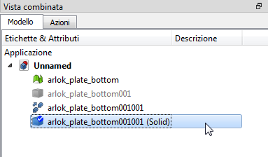

## Convertire un Mesh in una parte

> Questi sono degli appunti in Italiano scritti in base alle [istruzioni riportate nella documentazione di FreeCad](https://wiki.freecadweb.org/Part_ShapeFromMesh).  
  

Quando si importa un file STL in programmi di grafica 3D, questo viene incluso come `Mesh` e non come `Part` per cui può essere difficile lavorarci su. La soluzione è convertire il file STL in formato STEP (.STP, .STEP).  
  

Per prima cosa bisogna scaricare ed installare [FreeCad](https://www.freecadweb.org/).  

Caricare il file STL dal menù `File` -> `Apri`  

Dal menù a discesa [Visualizza:ambienti](https://wiki.freecadweb.org/Std_Workbench/it) (di default è visualizzata una freccia con Start) Selezionare `Parte`:  

  

> In alternativa l'ambiente parte è visualizzabile dal menù `Visualizza` > `Ambiente` > `Parte`

Compare una nuova voce di menù `Parte` nella barra dei menù.  

Selezionare il file STL dall'albero del modello:  

  

Dalla nuova voce di menù `parte` selezionare `Crea forma da Mesh`:  

  

Compare una finestra in cui viene chiesto quale tolleranza utilizzare.  

> Dalla guida ufficiale si vede che è possibile inserire in questa finestra dei numeri decimali, nella finestra che compare a me, invece, posso inserire soltanto un numero intero da 1 a 10 e, con le parti che ho disegnato, non trovo differenze tra 1 e 10: il solido generato è sempre uguale, per cui non ho idea su cosa vada ad influire di preciso questo valore.

Nell'albero dei modelli appare un nuovo oggetto al di sotto del file STL, con l'icona di un cubo, questa è una `forma`: nel nome ha il suffisso 001.  

Affiniamo la forma: selezionare la forma appena creata e dal menù `Parte` selezionare `Create a Copy` > `Affina una forma`:  

  

Nell'albero del modello compare la forma affinata il cui nome ha un altro suffisso 001.  

Selezionare questa nuova forma nell'albero del modello e dal menù `Parte` selezionare `Converti in solido`.  

Nell'albero del modello ora compare anche il solido, il cui nome presenta il suffisso (solid). Selezionarlo:  

  

Dal menù `File` selezionare `Esporta` e salvare come `STEP with Colors`.