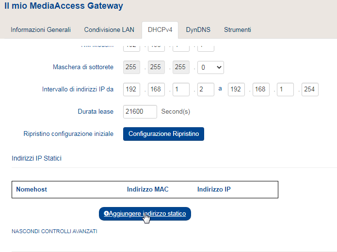

### Impostare IP statico col Wi-Fi

Controllare lo stato del servizio dhcpcd:

    sudo service dhcpcd status
    
Dovrebbero uscire dei messaggi in cui dice che il servizio è attivo, se così non fosse, attivarlo e fare in modo che si attivi in automatico all'avvio:

    sudo service dhcpcd start
    sudo systemctl enable dhcpcd
    
Ora aprire il file _dhcpcd.conf_

    sudo nano /etc/dhcpcd.conf
    
Aggiungere alla fine del file:

    interface wlan0
    static ip_address=192.168.1.13/24
    static routers=192.168.1.1
    static domain_name_servers=192.168.1.1 8.8.8.8 8.8.4.4
    noipv6
    
Cambiare gli indirizzi ip (nell'esempio il 13 è quello che voglio assegnare e 1 -static_routers- è quello del router, lasciare lo /24 alla fine dell'indirizzo IP).  
Gli altri due indirizzi IP in _domain_name_server_, oltre a quello del router, sono dei server DNS di Google. Le versioni precedenti di Raspbian accettavano _SSID (nome della rete WiFi)_ al posto di _interface wlan0_ e _inform 192.168.1.13_ al posto di _static ip_address=192.168.1.13/24_ provando ad utilizzare queste vecchie sintassi si nota che il simbolo del WiFi sul raspberry scorre di continuo (per dire: collegamento in corso) anzichè rimanere fisso, andando a controllare il servizio DHCPCD come illustrato prima viene scritto in rosso _unknown option: SSID_ e utilizzando un'app come [FING](https://play.google.com/store/apps/details?id=com.overlook.android.fing&hl=it&gl=US) su Android, viene rilevato che l'indirizzo IP è assegnato ma il Raspberry è comunque invisibile alla rete (non è possibile collegarsi ad internet, non si può usare SSH, VNC ecc). Cambiando solo _SSID_ con _interface wlan0_, il servizio DHCPCD non mostra errori ma si ha lo stesso comportamento: Raspberry invisibile alla rete. La sintassi da utilizzare, che a me ha funzionato su Raspberry Pi4 con l'ultima versione (dicembre 2020) di Raspberry Pi OS, è quella illustrata sopra.

Se il nostro dispositivo viene collegato successivamente ad un altro che "si è preso" quell'indirizzo IP, il Raspberry non si riuscirà a collegare: in questi casi dando _sudo service dhcpcd status_ è possibile leggere degli errori in rosso nel report:  

    wlan0: hardware address xx:xx:xx:xx:xx:xx claims 192.168.1.13
    wlan0: DAD detected 192.168.1.13
    control_handle_data: Operation not permitted
    
 dove la serie di _xx_ è il MAC Address del dispositivo a cui è stato assegnato l'indirizzo IP (192.168.1.13 nell'esempio) che abbiamo impostato come statico nel file _dhcpcd.conf_. 
 
 A questo punto la cosa migliore da fare, in ogni caso, è quella di assegnare indirizzi IP statici direttamente dal router.
 Nel modem della TIM, ad esempio, è possibile farlo dal menù _Il mio Media Access Gateway_ > _DHCPv4_ qui bisogna cliccare _Mostra Controlli avanzati_ e compare una sezione _Indirizzi IP Statici_, cliccando sul tasto _Aggiungere indirizzo statico_ è possibile selezionare da un elenco il dispositivo nella colonna _Nomehost_: in questo caso il campo del MAC Address viene compilato in automatico, altrimenti se il nostro dispositivo non compare perchè non si è collegato, possiamo scrivere l'indirizzo MAC a mano.

 